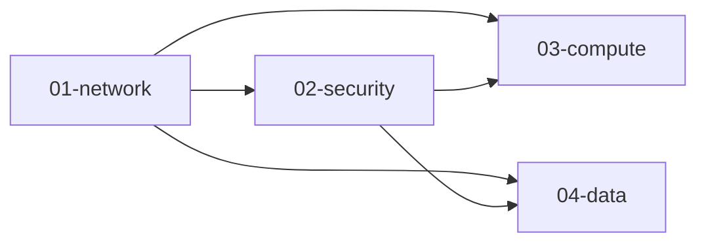

# Hạ Tầng (Terraform)

Mã Terraform theo dạng module, tổ chức theo **layer** để triển khai độc lập từng tầng hạ tầng.

## Kiến Trúc Layer

```
environments/dev/
├── 01-network/     → VPC, Subnets, NAT, IGW, Route Tables
├── 02-security/    → Security Groups (ALB, EKS, RDS)
├── 03-compute/     → EKS Cluster, Node Groups, IRSA
└── 04-data/        → RDS PostgreSQL
```

Mỗi layer có **state file riêng** trên S3. Layer sau đọc output của layer trước qua `terraform_remote_state`.



## Các Module

| Module | Mô tả |
|--------|-------|
| `vpc` | VPC với public, private, database subnets trên 2 AZ |
| `security` | Security Groups theo nguyên tắc Least Privilege |
| `eks` | EKS cluster, managed node groups, OIDC, IRSA |
| `rds` | RDS PostgreSQL với gp3, mã hoá, Multi-AZ |

## Triển Khai Theo Thứ Tự

```bash
# Bước 0: Khởi tạo backend (chạy 1 lần)
cd backend && terraform init && terraform apply

# Bước 1: Network
cd environments/dev/01-network
terraform init && terraform plan && terraform apply

# Bước 2: Security Groups
cd ../02-security
terraform init && terraform plan && terraform apply

# Bước 3: EKS Cluster
cd ../03-compute
terraform init && terraform plan && terraform apply

# Bước 4: Database
cd ../04-data
terraform init && terraform plan && terraform apply
```

> **Quan trọng:** Phải deploy theo đúng thứ tự 01 → 02 → 03 → 04 vì mỗi layer phụ thuộc vào output của layer trước.

## So Sánh Cấu Hình Theo Môi Trường

| Cấu hình | Dev | Prod |
|-----------|-----|------|
| NAT Gateway | Đơn (1 cái) | Kép (mỗi AZ) |
| EKS Nodes | 2× t3.medium | 3× t3.large |
| RDS Multi-AZ | ❌ | ✅ |
| RDS Instance | db.t3.micro | db.t3.medium |
| Backup | 1 ngày | 7 ngày |
| Bảo vệ xoá | ❌ | ✅ |

## Thêm Môi Trường Mới

1. Sao chép `environments/dev/` thành `environments/<env>/`
2. Cập nhật backend key trong `providers.tf` mỗi layer: `environments/<env>/0X-layer/terraform.tfstate`
3. Chỉnh `terraform.tfvars` của mỗi layer
4. Deploy theo thứ tự 01 → 02 → 03 → 04

## Huỷ Hạ Tầng

Khi cần xoá, huỷ **ngược thứ tự**:
```bash
cd 04-data    && terraform destroy
cd 03-compute && terraform destroy
cd 02-security && terraform destroy
cd 01-network && terraform destroy
```
